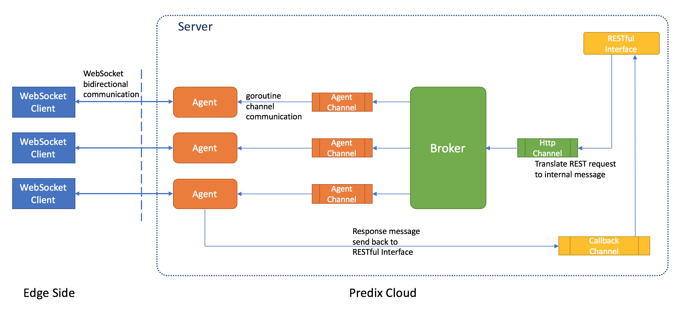

# 使用WebSocket从Predix云发命令到边缘设备

## WebSocker服务器软件架构

实现一个WebSocket服务器一点都不困难，因为各种高级语言都有相应的开发框架，我们可以在几分钟内就能完成。真正需要注意的是，当WebSocket服务器已经连接了多个客户端的场景下，**如何传递命令到相应的WebSocket客户端**，而不是广播给所有的客户端。下图就是我们的一个示例，用Go语言实现的WebSocket服务器。

WebSocket服务器架构如下图所示，



我们可以看到，

1. WebSocket服务器运行在Predix云平台上。
2. 客户端通过WebSocket协议与Predix云平台上的WebSocket服务器通信。
3. 服务器端实现了`agent`，`broker`和`REST Interface`几个核心组件。
4. 服务器为每个WebSocket连接创建一个`agent`实例。`agent`实例一方面负责同WebSocket客户端进行双向通信，另一方面，`agent`还接收`broker`下发的命令并转发到客户端。
5. 服务器创建一个`broker`实例。该`broker`实例负责注册每个`agent`实例，并在接收到具体的命令后，转发给相应的`agent`实例。也就是说，我们通过`broker`实例实现了传递命令到相应的WebSocket客户端，而不是广播给所有客户端的功能。
6. `REST Interface`实现了`/agents`的`GET`方法。因此，用户可以通过浏览器发送相应的请求给`broker`实例，而`broker`实例则会转发命令给相应的`agent`实例。
7. 同时，`REST Interface`会为每个请求创建一个`callback`管道，`agent`实例将客户端执行命令的结果通过该`callback`管道返回给`REST Interface`。因此，用户在浏览器中就可以看到边缘节点执行命令的结果。

## Go语言代码实例

介绍完架构设计，让我们看看代码实现。

### 下载代码示例

```sh
git clone https://github.com/pxie/go.in.practices.git
cd go.in.practices/websocket/
```

### 实现WebSocket服务器

首先，我们需要实现一个运行在Predix平台的WebSocket服务器，而且实现两个URL的处理函数，

1. 处理WebSocket客户端通过`wss://<主机名>/register`注册到服务器的请求
2. 处理用户通过浏览器访问`https://<主机名>/agents`获取客户端系统信息的请求

>注：严格意义上说，我们实现的服务器同时提供WebSocket接口和RESTful接口，不只是WebSocket服务器。

```go
// server.go
func main() {
	...
	http.HandleFunc("/", home)

	http.HandleFunc("/agents", func(w http.ResponseWriter, r *http.Request) {
		agentsHandler(broker, w, r)
	})

	// create agent, and register it to broker
	http.HandleFunc("/register", func(w http.ResponseWriter, r *http.Request) {
		serveWs(broker, w, r)
	})
```

### 实现broker，并初始化一个实例

其次，我们需要实现`broker`。`broker`实例通过register管道接收新创建的`agent`实例，接着存储到`conns`键值对中完成`agent`注册功能。在WebSocket服务器的初始化过程中，通过goroutine来运行一个`broker`的实例。在本例中，我们使用Go语言的内部类型map存储所有的键值对。如果要实现分布式无状态的横向扩展，我们可以非常方便的将`agent`实例的信息存储到外部存储服务中，例如Predix云平台的Redis服务。

```go
// broker.go
type broker struct {
	// register channel to add new websocket connect to broker
	register chan map[string]*agent

	// channel to get message from http server to broker
	httpCh chan *message

	// record all websocket conns
	conns map[string]*agent
}

// server.go
func main() {
	broker := newBroker()
	go broker.start()

```

### 实现agent

再次，我们需要实现`agent`。每当有新的WebSocket客户端注册到服务器端，就会创建一个`agent`实例。接着，`agent`实例会通过register管道把自己注册到`broker`中。最后，`agent`会启动一个goroutine接收`broker`下发的命令，并完成与WebSocket客户端的交互。
```go
// agent.go
type agent struct {
	// broker to know every agent
	b *broker

	// connect to remote client via websocket
	conn *websocket.Conn

	// channel get message from broker
	agentCh chan *message
}

func serveWs(b *broker, w http.ResponseWriter, r *http.Request) {
	conn, err := upgrader.Upgrade(w, r, nil)

	ag := &agent{b: b, conn: conn, agentCh: make(chan *message, 256)}
	agentID := uuid.NewV4().String()

	// build map to register agent
	reg := make(map[string]*agent)
	reg[agentID] = ag
	b.register <- reg

	// one goroutine to handle communication between agent to remote client, and broker
	go ag.start()
}
```

### 实现WebSocket客户端

最后，我们需要实现WebSocket客户端，它首先完成向WebSocket服务器的注册，然后就不断监听WebSocket服务器下发的消息，并根据消息的内容，执行相应的处理函数，最终将处理结果通过WebSocket连接返回给WebSocket服务器。

```go
// client/client.go
func main() {
	addr := "websocket-server.run.aws-jp01-pr.ice.predix.io"
	u := url.URL{Scheme: "wss", Host: addr, Path: "/register"}

	log.Printf("connect to %s", u.String())
	conn, _, err := websocket.DefaultDialer.Dial(u.String(), nil)
	if err != nil {
		log.Fatal("connect to websocker server error.", err)
	}
	defer conn.Close()

	ticker := time.NewTicker(10 * time.Second)
	defer ticker.Stop()

	for {
		select {
		case <-ticker.C:
			_, msg, err := conn.ReadMessage()
			if err != nil {
				log.Fatalln("read message from websocket error.", err)
			}
			exec(string(msg), conn)
		}
	}
}
```

## 推送到Predix云平台

和推送其他应用一样，我们用`cf push`就可以完成WebSocket服务器的推送。

推送完成的结果如下所示，
```
requested state: started
instances: 1/1
usage: 170M x 1 instances
urls: websocket-server.run.aws-jp01-pr.ice.predix.io   <-- 推送app后获得的URL
last uploaded: Tue Sep 26 04:20:50 UTC 2017
stack: cflinuxfs2
buildpack: https://github.com/cloudfoundry/go-buildpack.git

     state     since                    cpu    memory         disk           details
#0   running   2017-09-26 12:21:52 PM   0.0%   5.5M of 170M   7.7M of 350M
```

### 获取当前所有已注册的`agent`信息

我们可以通过浏览器访问`https://websocket-server.run.aws-jp01-pr.ice.predix.io/agents`来获取当前已注册的`agent`信息。和预期的一样，因为没有任何WebSocket客户端连接到服务器端，所以返回的结果是没有`agent`已经注册。

### 注册WebSocket客户端

因为，每个人推送到Predix云平台上WebSocket服务器的URL都是不一样的。因此，我们需要修改客户端的代码，指向正确的地址并重新编译。
```go
// client/client.go
func main() {
	// 修改为正确的地址
	addr := "websocket-server.run.aws-jp01-pr.ice.predix.io"

}

// 保存client.go文件
// 运行go build命令完成编译
```

当编译完成后，我们就可以运行client/路径下的`./client`可执行文件，将`agent`注册到`broker`。

这时，我们再次访问`/agents`页面就会得到`agent`相关的信息。
```json
[{"AgentID":"298ee2a5-d43b-426c-b42c-04c14a6aae41","RemoteAddr":"10.120.3.10:8446"}]
```

### 查询WebSocket客户端的系统信息

最后，我们可以通过浏览器访问`/agents?id=<AgentID>`来查询WebSocket客户端的系统信息，包括执行WebSocket客户端的操作系统，CPU信息和主机信息。通过这个请求，我们从浏览器发送命令到指定的`agent`实例，然后`agent`将命令转发给WebSocket客户端，客户端执行相应的命令，并把命令执行的结果返回给浏览器展示。

```http
> GET /agents?id=bc93384d-e46b-4508-ab7e-18ec55d9652d HTTP/1.1
> Host: websocket-server.run.aws-jp01-pr.ice.predix.io
> User-Agent: curl/7.43.0
> Accept: */*
>
< HTTP/1.1 200 OK
< Content-Length: 1073
< Content-Type: text/plain; charset=utf-8
< Date: Tue, 26 Sep 2017 04:57:14 GMT
< X-Vcap-Request-Id: 9cba4b18-e4ba-42fb-5cea-afca45385fd0
<
OS: darwin
CPU: [{"cpu":0,"vendorId":"GenuineIntel","family":"6","model":"70","stepping":1,"physicalId":"","coreId":"","cores":4,"modelName":"Intel(R) Core(TM) i7-4870HQ CPU @ 2.50GHz","mhz":2500,"cacheSize":256,"flags":["fpu","vme","de","pse","tsc","msr","pae","mce","cx8","apic","sep","mtrr","pge","mca","cmov","pat","pse36","clfsh","ds","acpi","mmx","fxsr","sse","sse2","ss","htt","tm","pbe","sse3","pclmulqdq","dtes64","mon","dscpl","vmx","smx","est","tm2","ssse3","fma","cx16","tpr","pdcm","sse4.1","sse4.2","x2apic","movbe","popcnt","aes","pcid","xsave","osxsave","seglim64","tsctmr","avx1.0","rdrand","f16c","smep","erms","rdwrfsgs","tsc_thread_offset","bmi1","avx2","bmi2","invpcid","fpu_csds","syscall","xd","1gbpage","em64t","lahf","lzcnt","rdtscp","tsci"],"microcode":""}]
host: {"hostname":"C02S8EWGG8WP","uptime":14451,"bootTime":1506387382,"procs":308,"os":"darwin","platform":"darwin","platformFamily":"","platformVersion":"10.11.6","kernelVersion":"15.6.0","virtualizationSystem":"","virtualizationRole":"","hostid":"b370db23-7244-3441-b95d-384442442565"}
```
>注：`/agents?id=<AgentID>`获取的是WebSocket客户端的系统信息，而不是Predix云平台上`agent`实例的系统信息。

通过这个示例，我们完整演示了如何从云端传递命令到相应的WebSocket客户端，并将执行的结果反馈回云端的全过程。